<!--
  Repo must be named exactly like your username: C81D1/C81D1
  Upload the whole `assets` folder too — every banner/diagram below loads from ./assets
-->

  

 

<i>Building systems on Earth with the goal of eventually building systems for space.</i>

 

 

| SUBSYSTEM | MODULES |
|:--|:--|
| **COMPUTING** |    |
| **OPERATING SYSTEMS** |  |
| **INFRASTRUCTURE** |    |
| **AI / DATA** |     |
| **DEVELOPMENT** | `[ ADD MODULE ]` `[ ADD MODULE ]` `[ ADD MODULE ]` |

 

 

<table>
<tr>
<td width="50%" valign="top">
<b>PAYLOAD 001 — [PROJECT NAME]</b> 
MISSION&nbsp; [WHAT IT DOES] 
STACK&nbsp;&nbsp;&nbsp; [TECHNOLOGIES] 
 <a href="https://github.com/C81D1/REPO-NAME">OPEN PAYLOAD →</a>
</td>
<td width="50%" valign="top">
<b>PAYLOAD 002 — [PROJECT NAME]</b> 
MISSION&nbsp; [WHAT IT DOES] 
STACK&nbsp;&nbsp;&nbsp; [TECHNOLOGIES] 
 <a href="https://github.com/C81D1/REPO-NAME">OPEN PAYLOAD →</a>
</td>
</tr>
<tr>
<td width="50%" valign="top">
<b>PAYLOAD 003 — [PROJECT NAME]</b> 
MISSION&nbsp; [WHAT IT DOES] 
STACK&nbsp;&nbsp;&nbsp; [TECHNOLOGIES] 
 <a href="https://github.com/C81D1/REPO-NAME">OPEN PAYLOAD →</a>
</td>
<td width="50%" valign="top">
<b>PAYLOAD 004 — [PROJECT NAME]</b> 
MISSION&nbsp; [WHAT IT DOES] 
STACK&nbsp;&nbsp;&nbsp; [TECHNOLOGIES] 
 <a href="https://github.com/C81D1/REPO-NAME">OPEN PAYLOAD →</a>
</td>
</tr>
</table>

 

 

  <!-- Public hosted graph; can rate-limit occasionally -->
  

  <!-- Generated daily by .github/workflows/profile-3d.yml -->
  

  
  
   
  

 

**Active interests:** C++ · Python · Linux · Docker · AI / ML · Systems engineering · Robotics · Aerospace · `[ ADD MORE ]`

 

*Learning targets. Not claimed expertise.*

- [ ] Embedded Systems
- [ ] ROS / Robotics
- [ ] CUDA
- [ ] Computer Vision
- [ ] Machine Learning (deeper)
- [ ] Distributed Systems
- [ ] Flight Software
- [ ] Spacecraft Systems
- [ ] Guidance / Navigation / Control
- [ ] `[ ADD TARGET ]`

 

 

*This is a small signal from Earth.* 
*It was sent by someone still learning how machines are built,* 
*and still curious about how they travel beyond the place they were made.*  
**No claim of mastery. Only direction.** 
*If this reaches you: the work continues.*

